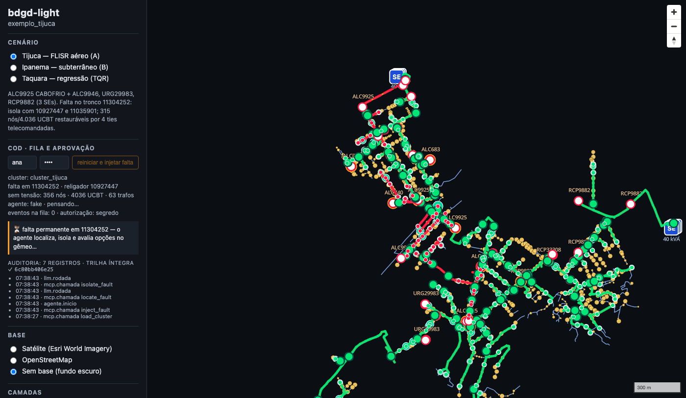
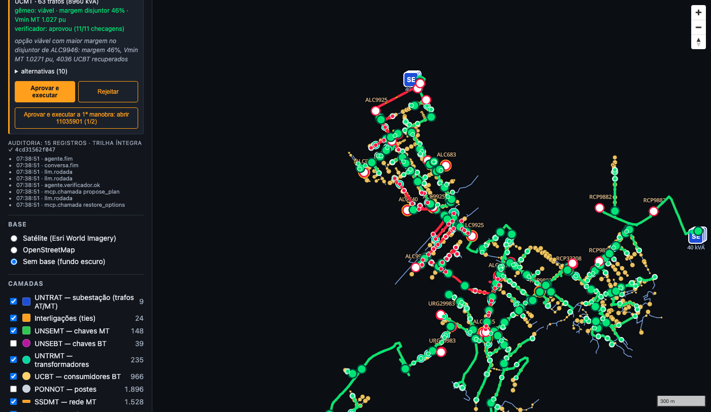
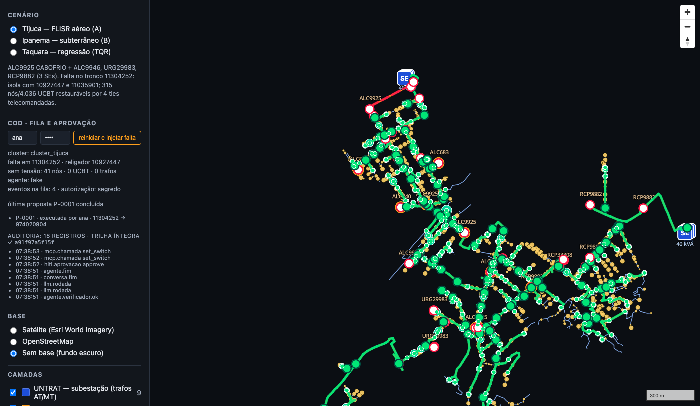

# bdgd-light

POC/MVP de um **Centro de Operação da Distribuição (COD) agêntico** sobre a **BDGD da Light**
(Rio de Janeiro), usando dados abertos da ANEEL. A ideia: expor a rede (topologia, chaves, cargas,
gêmeo digital em OpenDSS) como ferramentas para um agente de IA que monitora eventos, propõe manobras
(ex.: FLISR) e as submete à aprovação de um operador humano, num console com mapa.

Plano completo, módulos e fases em [`docs/PLANO.md`](docs/PLANO.md); decisões de stack e
arquitetura (e alternativas descartadas) em [`docs/adr/ADR-001-stack.md`](docs/adr/ADR-001-stack.md).

## A demo em três telas

Falta no tronco do alimentador ALC9925 (Tijuca): o agente localiza e isola a falta no gêmeo, compara
as rotas de restauração e propõe uma; o operador aprova — de uma vez ou **uma manobra por clique** —
e o mapa recolore com o estado da rede. Capturas geradas pelo smoke headless
(`SMOKE_CAPTURAS`, [`docs/demo-roteiro.md`](docs/demo-roteiro.md) tem o roteiro de 15 min para aula).

| 1 · evento em curso | 2 · proposta, alternativas e motivos | 3 · aprovada e executada |
|---|---|---|
|  |  |  |

## Estrutura

```
src/bdgd_light/        pacote Python (ingest, grid, twin, mcp_server, agent, sim)
  catalogo.py          IDs da BDGD por distribuidora/ano, camadas-chave, domínios TEN_NOM e TIP_UNID
  cli.py               CLI `bdgd-light` (typer): export, inventario, vizinhos, recortar, grafo, dss,
                       tiles, llm, audit, mcp, aprovar, sim, agente, serve, bench
  ingest/export.py     exportação de camadas para GeoParquet/Parquet/GeoPackage, em lotes
  ingest/parquet.py    leitura das camadas exportadas com filtros empurrados ao pyarrow
  ingest/interligacoes.py  detecção geométrica de chaves NA de interligação entre CTMT
  ingest/inventario.py inventário de alimentadores (CSV + tabela)
  ingest/recorte.py    recorte de todas as camadas por CTMT → GeoPackage + meta.json
  ingest/tiles.py      recorte GPKG → GeoJSONSeq 4326 (atributos derivados para o estilo) → tippecanoe
                       → PMTiles para o console
  grid/rede.py         grafo MT (networkx) do alimentador/cluster: fonte, chaves, ties, isolamento,
                       restauração; grid/geojson.py exporta o estado em GeoJSON 4326
  twin/gpkg2dss.py     GPKG do recorte → OpenDSS direto (paridade com o bdgd2opendss, sem FileGDB);
                       twin/convert.py BDGD → OpenDSS via bdgd2opendss (36 Masters por CTMT);
                       twin/powerflow.py resolve o fluxo com OpenDSSDirect (tensões, violações,
                       perdas, sobrecargas); twin/cluster.py monta o Master do cluster e traduz
                       manobras do grafo em DSS; twin/score.py é o verificador elétrico das opções
                       de restauração (I no disjuntor, V MT, sobrecargas MT → viável)
  agent/llm.py         interface LLMClient (chat com tool calling), FakeLLMClient para testes,
                       OpenAICompatClient (qualquer API chat/completions) com perfis openai/gemini/
                       ollama/fake (ADR-003) e preset GitHubModelsClient (aposentado);
                       agent/audit.py é o log de auditoria encadeado por hash (JSON Lines)
  mcp_server/          servidor MCP das ferramentas de rede (sessao.py = domínio: cluster carregado,
                       falta simulada, propostas com aprovação humana e auditoria; servidor.py = camada
                       MCP stdio/http + rotas de aprovação; humano.py = identidade do operador,
                       aprovar/rejeitar/executar e hitl.jsonl); docs/mcp-ferramentas.md
  console/api.py       backend do console (`bdgd-light serve`, FastAPI): fila de eventos, estado do
                       gêmeo em GeoJSON, propostas, aprovação/rejeição e agente em segundo plano;
                       docs/console.md
  sim/                 simulador de eventos (faltas permanentes/transitórias por km, pico de carga,
                       chave telecomandada indisponível; cenários nomeados da demo) + fila JSONL
                       em data/eventos/; docs/sim.md
  agent/orquestrador.py  agente orquestrador + verificador HITL (padrão PowerChain): prompt com
                       exemplos anotados (docs/agent/exemplos.yaml), ferramentas da SessaoCOD sem
                       set_switch, verificador determinístico antes de propose_plan, operador fake
                       para testes e métricas por execução; docs/agent.md
console/               console do operador: Vite + TypeScript + MapLibre GL JS lendo PMTiles
                       (public/tiles/exemplo_{tijuca,ipanema}.pmtiles = clusters da demo; exemplo.pmtiles
                       = TQR, regressão), seletor de cenário, sobreposição do estado do grafo, painel
                       do COD (src/cod.ts: injetar falta, proposta do agente, aprovar/rejeitar,
                       auditoria) sobre `bdgd-light serve`, smoke test headless (scripts/smoke.mjs,
                       SMOKE_FLUXO=1 = demo ponta a ponta); publicado no Pages por Actions
scripts/
  baixar_bdgd.py       baixa e extrai a BDGD (Light 2025 por padrão)
  listar_camadas.py    lista as camadas do .gdb
  converter.py         camada → GeoJSON (EPSG:4326) com recorte por bbox
  listar_modelos.py    lista os modelos do provedor LLM configurado (destaca tool calling)
  regioes_inventario.py tabela por bairro de referência do inventário (docs/escopo-cidade.md)
index.html             visor Leaflet legado (arrastar o GeoJSON de scripts/converter.py); o console
                       novo é console/
docs/                  plano, ADRs (adr/ADR-001-stack.md, ADR-002-console-maplibre-pmtiles.md,
                       ADR-003-provedor-llm.md), notas da BDGD Light 2025 (bdgd-light-2025.md),
                       regras de junção entre camadas (bdgd-relacoes.md), escolha dos alimentadores
                       (escopo-cidade.md = v3, clusters Tijuca e Ipanema; escopo-alimentadores.md = v2,
                       cluster TQR), mapeamento BDGD → grafo (grid-modelo.md),
                       spikes OpenDSS (spike-opendss.md) e LLM (spike-llm.md)
tests/                 pytest (fixtures sintéticas; dados reais nunca vão para o git)
  fixtures/            bdgd_mini.gpkg (BDGD sintética, 21 camadas, 3 CTMT com interligações
                       geométricas), bairro_sintetico.geojson e gerar_fixture.py, que os (re)cria;
                       dss/ieee13/ (alimentador IEEE 13 barras para o fluxo de potência)
data/                  dados baixados/derivados (ignorado pelo git)
```

## Começando

Ambiente sempre isolado com [uv](https://docs.astral.sh/uv/) (nada é instalado no Python do sistema):

```bash
uv sync --extra dev                # cria .venv e instala; + --extra twin --extra agent para OpenDSS e MCP
uv run scripts/baixar_bdgd.py      # Light 2025-12-31 (~1,1 GB)
uv run scripts/listar_camadas.py data/Light_382_2025-12-31_V11_20260824-0926.gdb
uv run pytest && uv run ruff check .
```

Qualquer comando do projeto é `uv run <comando>`; para adicionar dependência, `uv add <pacote>` (e `uv lock`).

Outras versões: `--dist light --ano 2024` (ver `src/bdgd_light/catalogo.py`).

## Comandos

### `bdgd-light export` — camadas da BDGD → GeoParquet/Parquet

Converte o File Geodatabase (~1,1 GB, 43 camadas) para um formato colunar rápido, base das etapas
seguintes (inventário de alimentadores, grafo, tiles):

```bash
# todas as CAMADAS_CHAVE do catálogo que existirem na base → data/parquet/<CAMADA>.parquet
uv run bdgd-light export --gdb data/Light_382_2025-12-31_V11_20260824-0926.gdb

# só algumas camadas, saída em outro diretório e também num GeoPackage único (abre no QGIS)
uv run bdgd-light export --gdb data/Light_382_2025-12-31_V11_20260824-0926.gdb \
    --layers CTMT,SSDMT,UNSEMT,UNTRAT,CRVCRG --out data/parquet --gpkg data/light.gpkg
```

| opção | padrão | descrição |
|---|---|---|
| `--gdb` | (obrigatório) | caminho do `.gdb` (ou de um GeoPackage) |
| `--layers` | `CAMADAS_CHAVE` | camadas separadas por vírgula; camada inexistente → erro claro (exit 1). Sem `--layers`, camadas do catálogo ausentes na base são apenas avisadas e puladas |
| `--out` | `data/parquet` | diretório de saída, um `.parquet` por camada |
| `--gpkg` | — | grava também todas as camadas exportadas (inclusive tabelas) num GeoPackage único |
| `--batch-size` | `100000` | feições por lote de leitura/escrita |

- Camadas geográficas (SSDMT, UNSEMT, UNTRMT, PONNOT…) viram **GeoParquet** (geometria WKB,
  CRS SIRGAS 2000 / EPSG:4674 preservado): `geopandas.read_parquet("data/parquet/SSDMT.parquet")`.
- Tabelas sem geometria (CTMT, CRVCRG, EQTRMT, SEGCON, UCBT_tab, UCMT_tab…) viram **Parquet**
  comum: `pandas.read_parquet(...)`.
- A leitura usa o *stream* Arrow do GDAL em lotes, então camadas grandes não estouram a memória
  (Light 2025: SSDMT com 1,0 M de trechos em ~4 s e UCBT_tab com 5,0 M de linhas em ~23 s, pico de
  memória < 500 MB). O log mostra feições e tempo por camada.
- Na Light 2025 V11 **CTMT é uma tabela** (sem geometria), **não existe camada `UCBT`/`UCMT`/
  `UGBT`/`UGMT` geográfica** (só as tabelas `*_tab`) e as subestações estão em `SUB`/`UNTRAT`.
  Essas e outras particularidades da base (domínios `TEN_NOM` e `TIP_UNID`, numeração de `PAC` por
  alimentador, contagens por camada) estão em [`docs/bdgd-light-2025.md`](docs/bdgd-light-2025.md).

Para testar sem a BDGD real: `uv run bdgd-light export --gdb tests/fixtures/bdgd_mini.gpkg --out /tmp/parquet`
(a fixture sintética é recriada com `uv run tests/fixtures/gerar_fixture.py`).

### `bdgd-light inventario` — uma linha por alimentador (CTMT)

Relatório para escolher os alimentadores do escopo (cenário FLISR: chaves NA de interligação para
transferência de carga, DER, densidade de clientes). Lê o diretório do `export`; Light 2025 inteira
(1.802 CTMT, 1,0 M de trechos MT, 5,0 M de UCBT) em ~3,5 s.

```bash
uv run bdgd-light inventario --parquet data/parquet --out data/inventario_ctmt.csv --top 20
uv run bdgd-light inventario --parquet data/parquet --bairro data/jacarepagua.geojson --top 10
```

| opção | padrão | descrição |
|---|---|---|
| `--parquet` | `data/parquet` | diretório com as camadas exportadas (`CTMT` e `SSDMT` obrigatórias; as demais opcionais — ausentes geram aviso e colunas zeradas) |
| `--out` | `data/inventario_ctmt.csv` | CSV de saída, ordenado por `score` decrescente |
| `--top` | `20` | quantos CTMT mostrar na tabela do terminal (`0` = nenhuma tabela) |
| `--bairro` | — | polígono (GeoJSON/GPKG, EPSG:4326 se sem CRS) que restringe aos CTMT com rede MT que o intersecta; as interligações continuam sendo detectadas contra a base inteira |
| `--raio-tie` | `2` | raio (m) entre chave NA e extremidade de SSDMT de outro CTMT para contar como interligação |

Colunas do CSV (as regras de junção estão em [`docs/bdgd-relacoes.md`](docs/bdgd-relacoes.md)):

| coluna | significado | colunas da BDGD usadas |
|---|---|---|
| `COD_ID`, `NOME` | código e nome do alimentador | `CTMT.COD_ID`, `CTMT.NOME` |
| `tipo` | prefixo do nome: `LDA` aérea, `LDS` subterrânea, `LSA`/`LSS` 25 kV, `TRAFO` | primeira palavra de `CTMT.NOME` |
| `SUB`, `SUB_NOME` | subestação e seu nome | `CTMT.SUB` → `SUB.COD_ID`, `SUB.NOME` (UNTRAT não tem nome) |
| `UNI_TR_AT` | transformador de força que alimenta o CTMT | `CTMT.UNI_TR_AT` (→ `UNTRAT.COD_ID`) |
| `TEN_NOM`, `TEN_NOM_kV` | código do domínio *TEN* e a tensão em kV (`46` = 13,2; `67` = 25) | `CTMT.TEN_NOM`, `catalogo.TENSAO_KV` |
| `MUN` | município (IBGE) majoritário | moda de `UNTRMT.MUN` (ou `UNSEMT.MUN`) dos ativos do CTMT |
| `km_MT` | extensão da rede MT | Σ `SSDMT.COMP` (m) / 1000, por `SSDMT.CTMT` |
| `ENE_MWh_ano` | energia anual do alimentador | Σ `CTMT.ENE_01..ENE_12` (kWh) / 1000 |
| `ENE_UC_MWh_ano` | energia anual das unidades consumidoras | Σ `ENE_01..12` de `UCBT_tab` (via transformador) + `UCMT_tab` |
| `n_UNTRMT`, `kVA_instalado` | transformadores MT/BT e potência instalada | `UNTRMT.CTMT`, Σ `UNTRMT.POT_NOM` |
| `n_UCBT` | unidades consumidoras BT | `UCBT_tab.UNI_TR_MT` → `UNTRMT.CTMT` (não a coluna `CTMT` da tabela, que diverge em 0,09 % das UCs) |
| `n_UCMT` | unidades consumidoras MT | `UCMT_tab.CTMT` |
| `n_DER`, `kW_DER` | geração distribuída e potência | `UGBT_tab.UNI_TR_MT` → `UNTRMT.CTMT` e `UGMT_tab.CTMT`; Σ `POT_INST` |
| `chaves_total`, `chaves_NA`, `chaves_NF` | chaves MT do alimentador e estado normal | `UNSEMT.CTMT`, `P_N_OPE` (`A` aberta, `F` fechada) |
| `chaves_telecomandadas` | chaves com telecomando | `UNSEMT.TLCD = 1` |
| `NA_interligacao` | chaves NA que interligam este CTMT a outro (**detecção geométrica**, contadas dos dois lados: a chave cadastrada no vizinho a ≤ 2 m de um trecho deste CTMT também conta) | `UNSEMT.geometry` + `P_N_OPE = "A"` × extremidades de `SSDMT` com outro `CTMT` |
| `NA_interligacao_telecomandada` | idem, só telecomandadas | + `UNSEMT.TLCD = 1` |
| `NA_interligacao_SE` | idem, chaves dentro do polígono da subestação ou a até 50 m dele (disjuntores de saída e barras do pátio — não são *ties* de campo; a folga reclassificou 545 chaves na Light, 31 delas no LDS 9210 de Ipanema) | + `SUB.geometry` (`raio_sub_m`) |
| `NA_interligacao_campo` | `NA_interligacao` menos as da SE — as chaves que interessam a um cenário FLISR | `EM_SUB = False` |
| `NA_interligacao_campo_telecomandada` | idem, só telecomandadas | + `UNSEMT.TLCD = 1` |
| `n_vizinhos`, `vizinhos` | CTMT interligados (contagem e lista `;`) | idem |
| `n_UNREMT`, `n_UNCRMT` | reguladores e capacitores | `UNREMT.CTMT`, `UNCRMT.CTMT` |
| `lon_min`, `lat_min`, `lon_max`, `lat_max` | bbox da rede MT em EPSG:4326 | limites de `SSDMT.geometry` por CTMT, reprojetados |
| `score` | `NA_interligacao_campo × (n_UCBT + n_UCMT)` — ordena a tabela `--top` (ties de campo × clientes; os disjuntores da SE não contam) | — |

Na Light 2025 os `PAC` são numerados por alimentador e **não há PAC compartilhado entre CTMT**, por
isso a interligação é detectada geometricamente (chave NA a ≤ 2 m de uma extremidade de `SSDMT` de
outro CTMT, em UTM SIRGAS 2000). Detalhes e ressalvas (chaves em barramento de SE, chaves com vários
vizinhos) em [`docs/bdgd-relacoes.md`](docs/bdgd-relacoes.md); a escolha dos clusters da demo (v3:
Tijuca `ALC9925,ALC9946,URG29983,RCP9882` e Ipanema `PTS0001,PTS9088,PTS9924,PTS4022`) em
[`docs/escopo-cidade.md`](docs/escopo-cidade.md) e a do cluster TQR (PARNAIBA / CURUMAU / BOCARI,
SETD Taquara, hoje rede de regressão) em [`docs/escopo-alimentadores.md`](docs/escopo-alimentadores.md).
Chaves NA a até 50 m do polígono da SE contam como "na SE" (`EM_SUB`), não como tie de campo — caso
do pátio da SE Posto Seis, em Ipanema.

### `bdgd-light vizinhos` — com quem um alimentador se interliga

```bash
uv run bdgd-light vizinhos --ctmt TQR0007 --parquet data/parquet            # só ties de campo (padrão)
uv run bdgd-light vizinhos --ctmt TQR0007 --parquet data/parquet --com-se   # inclui disjuntores da SE
```

Tabela com um CTMT vizinho por linha: nº de ties, quantas telecomandadas/manuais, quantas dentro da
SE, quantas chaves são do próprio CTMT e quantas do vizinho, e os `COD_ID` das chaves. Por padrão
(`--sem-se`) as chaves dentro do polígono da SE ficam **fora** de todas as contagens e da lista de
chaves — a coluna "Na SE" mostra quantas foram descontadas e um vizinho ligado só pela SE continua
listado com 0 ties; `--com-se` conta tudo, como no inventário. O título traz os totais em chaves
distintas e em pares chave×vizinho — uma chave num barramento de SE pode tocar vários alimentadores.
Aceita `--raio-tie`.

Para `TQR0007` (PARNAIBA): BOCARI 8 ties (2 telecomandadas), TQR33830 3, CURUMAU 2 (1) — nenhuma na
SE.

### `bdgd-light recortar` — um GeoPackage por alimentador (e um do cluster)

Unidade de trabalho do resto do projeto (grafo, OpenDSS, tiles): todas as camadas de um CTMT num
GPKG (abre no QGIS), mais um `meta.json` com contagens, bbox e interligações.

```bash
# um GPKG por CTMT + o GPKG do cluster (união), em data/feeders/
uv run bdgd-light recortar --parquet data/parquet --ctmt TQR0007,TQR33859,TQR33862 --out data/feeders
# um só CTMT num arquivo com nome escolhido
uv run bdgd-light recortar --parquet data/parquet --ctmt TQR0007 --out data/feeders/parnaiba.gpkg
```

| opção | padrão | descrição |
|---|---|---|
| `--ctmt` | (obrigatório) | `COD_ID` dos alimentadores, separados por vírgula; inexistente → erro claro (exit 1) |
| `--parquet` | `data/parquet` | diretório com as camadas exportadas (`CTMT` obrigatória; ausentes são puladas com aviso) |
| `--out` | `data/feeders` | diretório de saída (`<CTMT>.gpkg` + `<CTMT>.meta.json` por alimentador e, com vários, `cluster_<A>-<B>….gpkg`); com um só CTMT pode ser o caminho de um `.gpkg` |
| `--nome-cluster` | `cluster_<A>-<B>…` | nome do GPKG do cluster |
| `--raio-tie` | `2` | raio da detecção de interligações |
| `--folga-bbox` | `500` | folga (m) do *bbox* da rede que limita `PONNOT`/`UCBT`; negativo desliga o filtro (issue #40) |

Camadas do GPKG, na ordem: `CTMT`, `SUB`, `UNTRAT` (subestação inteira do CTMT), `SSDMT`, `UNSEMT`,
`UNTRMT`, `UNREMT`, `UNCRMT`, `UCMT_tab`, `UGMT_tab` (pela coluna `CTMT`), `SSDBT`, `UNSEBT`, `RAMLIG`,
`UCBT_tab`, `UGBT_tab`, `PIP` (pelo transformador `UNI_TR_MT`), `PONNOT` (postes referenciados por
`PN_CON*` e dentro do *bbox* da rede do recorte + `--folga-bbox` — na Light 2025 `UCBT_tab.PN_CON`
aponta para postes a dezenas de km do alimentador; o que sai é contado em `avisos` no `meta.json`),
`EQTRMT`, `EQSE`, `EQRE`, `EQCR` (equipamentos das unidades), `SEGCON`, `CRVCRG` (só os códigos usados) e
`INTERLIGACOES` — camada calculada com as chaves NA de interligação que envolvem o CTMT, dos dois
lados (`COD_ID`, `CTMT`, `CTMT_VIZ`, `SSDMT_VIZ`, `PAC_VIZ`, `DIST_M`, `TLCD`, `TIP_UNID`, `EM_SUB`). As
camadas `UCBT`/`UCMT`/`UGBT`/`UGMT` geográficas entram se existirem (não existem na Light 2025).
`UNSEMT` do recorte contém só as chaves cadastradas no CTMT; as do vizinho estão em `INTERLIGACOES`.
Camadas sem feição para o CTMT não são gravadas, mas aparecem com `0` no `meta.json`. Os testes
garantem que nada de outro CTMT vaza para o recorte (regras em
[`docs/bdgd-relacoes.md`](docs/bdgd-relacoes.md)).

`meta.json`: `nome`, `ctmt` (`COD_ID`, `NOME`, `SUB`), `gerado_em`, `bdgd_light` (versão), `parquet`,
`crs` (`EPSG:4674`), `bbox_4326`, `camadas` (contagem por camada) e `interligacoes` (por par CTMT–vizinho:
`ties`, `ties_telecomandadas`, `ties_em_SE`, `chaves` — tudo o que a detecção achou — e `ties_campo`,
`ties_campo_telecomandadas`, `chaves_campo` — sem os disjuntores da SE, que é o que o FLISR usa).

Cluster do escopo na Light 2025 (`--ctmt TQR0007,TQR33859,TQR33862`): PARNAIBA 14.146 feições (675
SSDMT, 82 UNTRMT, 50 UNSEMT, 6.268 UCBT), CURUMAU 14.608, BOCARI 10.853, cluster 39.185 (23 camadas
cada) em ~3 s; ties de campo PARNAIBA–BOCARI 8 (2 telecomandadas), CURUMAU–BOCARI 7 (1),
PARNAIBA–CURUMAU 2 (1). Cluster alternativo `BMT0001,BMT29737,CBI33798` (DEPAIVA / AVEMAR / RABELO):
22.039 feições, todos os pares com ≥ 1 tie de campo telecomandada.

### `bdgd-light grafo` — grafo do alimentador, falta, isolamento e restauração

Monta a rede MT de um recorte como `networkx.Graph` (nós = PAC; arestas = trechos `SSDMT`, chaves
`UNSEMT` com estado NA/NF e ties da camada `INTERLIGACOES`), energiza a partir do disjuntor de saída
da SE (`CTMT.PAC_INI`) e simula manobras. Mapeamento e decisões em
[`docs/grid-modelo.md`](docs/grid-modelo.md).

```bash
# resumo + ties de um alimentador
uv run bdgd-light grafo --gpkg data/feeders/TQR0007.gpkg
# falta num trecho: chaves a abrir, clientes desligados e chaves NA que restauram; estado em GeoJSON
uv run bdgd-light grafo --gpkg data/feeders/cluster_TQR0007-TQR33859-TQR33862.gpkg \
    --falha 11798327 --geojson data/feeders/estado_tqr.geojson
# manobras manuais antes da análise
uv run bdgd-light grafo --gpkg data/feeders/TQR0007.gpkg --abrir 310744064 --fechar 752622332
# cenário A da demo (Tijuca): cada opção de restauração validada no gêmeo OpenDSS (--score)
uv run bdgd-light grafo --gpkg data/feeders/cluster_tijuca.gpkg --falha 11304252 --score
```

| opção | padrão | descrição |
|---|---|---|
| `--gpkg` | (obrigatório) | `<CTMT>.gpkg` (um alimentador; vizinhos viram nós externos `EXT:<CTMT>`) ou `cluster_….gpkg` (ties ligadas pelos PAC reais) |
| `--falha` | — | `COD_ID` de um trecho `SSDMT` em falta |
| `--abrir` / `--fechar` | — | `COD_ID` de chaves `UNSEMT` a manobrar antes da análise, por vírgula |
| `--geojson` | — | grava o estado (energizado/fonte por trecho, chaves, trafos) em EPSG:4326; com `--falha`, depois do isolamento |
| `--ties-na-se` | desligado | inclui como ties as chaves NA dentro do polígono da SE |
| `--score` | desligado | com `--falha`: roda o fluxo de potência de cada opção no gêmeo (`twin.score_eletrico`, extra `twin`) e acrescenta à tabela corrente no disjuntor da fonte, corrente nominal de referência, margem, Vmin MT, trechos MT sobrecarregados, perdas e o veredito **viável**; ordena por viável → margem → UCBT |
| `--dss-out`, `--dia`, `--mes` | `data/dss/gpkg`, `DU`, `1` | modelos OpenDSS por CTMT usados pelo `--score` (convertidos do GPKG se faltarem) e patamar de carga |
| `--vmin` / `--vmax` | 0,93 / 1,05 | faixa de tensão MT (pu) do veredito |

O veredito elétrico é **só MT**: `viavel` = convergiu ∧ `vmin ≤ V_MT ≤ vmax` nos nós da fonte e da
zona transferida ∧ `I_disjuntor ≤ I_nominal` ∧ nenhum trecho MT acima de 100 %. Como `UNSEMT.COR_NOM`
é um código de domínio sem tradução para ampères, `I_nominal` é a ampacidade (`normamps`) do
trecho-tronco logo após o disjuntor — `score_eletrico(..., nominais={"ALC9946": 630})` sobrepõe.
Na Tijuca (falta `11304252`, 4.036 UCBT desligados): ALC9946 viável com 320 A / 592 A (margem 46 %),
RCP9882 viável com 351 A / 438 A (20 %), URG29983 **inviável** por um trecho de 20 m a 180 % da
ampacidade (condutor de 132 A no caminho da tie); 7 fluxos em ≈10 s.

Em Python:

```python
from bdgd_light.grid import Cluster, Feeder, estado_geojson

f = Feeder.from_gpkg("data/feeders/TQR0007.gpkg")  # 719 nós, 675 trechos, 50 chaves, 13 ties
f.energized_nodes()
f.customers_downstream("TQR0007_MT_52738")
iso = f.isolate_segment("310743928")  # chaves mínimas a abrir, zona, desligados
for op in f.restore_options("310743928"):  # chaves NA que devolvem tensão, por clientes
    print(op.chave, op.fonte, op.tlcd, op.clientes)
c = Cluster.from_gpkg("data/feeders/cluster_TQR0007-TQR33859-TQR33862.gpkg")
estado_geojson(c, "estado.geojson")

# veredito elétrico das opções no gêmeo (extra `twin`; Master base do cluster sem manobras)
from bdgd_light.twin import montar_master_cluster, score_eletrico

master = montar_master_cluster(pastas_dos_ctmts, "data/dss/gpkg/cluster_x/Master_DU01_base.dss")
for sc in score_eletrico(c.restore_options("310743928"), c, master):  # já ordenados
    print(sc.chave, sc.viavel, sc.i_disjuntor_a, sc.margem_disjuntor, sc.motivos)
```

Cluster TQR na Light 2025: 2.069 nós, 46,65 km, 162 chaves, 35 ties, 16.504 UCBT, 0,1 s para montar.
Falta no tronco de BOCARI (`11798327`): abrir 4 chaves, 2.023 UCBT desligados, 10 opções que
restauram 1.984 via PARNAIBA (3 telecomandadas) ou CURUMAU (1 telecomandada).

### `bdgd-light dss` — alimentador em OpenDSS, fluxo de potência e manobras

Gera o modelo OpenDSS de um CTMT **direto do GeoPackage do recorte** (`twin.gpkg2dss`, ≈1 s por
alimentador, sem FileGDB) e resolve o fluxo de potência snapshot com OpenDSSDirect, reportando
tensões por nó, violações fora de 0,93–1,05 pu, perdas e sobrecargas. Com vários `--ctmt` monta um
Master único do cluster (uma `Vsource` por alimentador) e, com `--gpkg` (recorte do `bdgd-light
recortar`), traduz as manobras do grafo — falta, isolamento e restauração pela tie — em comandos
OpenDSS antes do `Solve`. Requer `uv sync --extra twin`.

**`--gpkg` é o padrão do projeto** (grafo e gêmeo leem a mesma rede, o recorte; modelos em
`data/dss/gpkg/<CTMT>/`). O [bdgd2opendss](https://github.com/PauloRadatz/bdgd2opendss) (`--gdb`;
lê o `.gdb` inteiro, ≈3 min por alimentador; modelos em `data/dss/sub_<SUB>/<CTMT>/`) fica só como
**oráculo de regressão de paridade** do conversor — critério em
[`docs/spike-opendss.md`](docs/spike-opendss.md#quando-usar---gpkg-×---gdb), que também traz o
relatório do spike (o que o conversor precisou, paridade, FLISR no gêmeo e decisões).

```bash
# Master direto do recorte (data/dss/gpkg/TQR0007/Master_DU01_gpkg_TQR0007.dss) + fluxo de dia útil
uv run bdgd-light dss --gpkg data/feeders/TQR0007.gpkg --json data/dss/gpkg/TQR0007_DU01.json
# cluster Tijuca (demo, cenário A) sem GDB: converte os 4 CTMT do GPKG, falta no tronco de CABOFRIO
# e restauração pela TLCD 974020904 (ALC9946); --reconverter regenera modelos já existentes
uv run bdgd-light dss --gpkg data/feeders/cluster_tijuca.gpkg --falha 11304252 --restaurar 974020904
# cluster TQR (regressão): falta no trecho 11798327 de BOCARI, isolamento pelo grafo e restauração
# fechando a tie telecomandada 1007642983 (via PARNAIBA)
uv run bdgd-light dss --gpkg data/feeders/cluster_TQR0007-TQR33859-TQR33862.gpkg \
    --falha 11798327 --restaurar 1007642983
# só o fluxo, em qualquer Master .dss, com um comando OpenDSS antes do Solve
uv run bdgd-light dss --master data/dss/gpkg/TQR0007/Master_SA01_gpkg_TQR0007.dss --comando "set loadmult=0.6"
# oráculo de paridade (bdgd2opendss, ≈3 min): converte TQR0007 do GDB para data/dss/sub_<SUB>/TQR0007/
# e habilita tests/test_gpkg2dss.py::test_paridade_tqr0007_real
uv run bdgd-light dss --gdb data/Light_382_2025-12-31_V11_20260824-0926.gdb --ctmt TQR0007 \
    --out data/dss --sem-fluxo
uv run pytest tests/test_gpkg2dss.py -q -k paridade   # rode depois de regerar recortes ou mexer no gpkg2dss
```

O conversor do GPKG reproduz a modelagem do bdgd2opendss (mesmas tabelas de códigos, fórmulas de kW
por curva de carga, nomes de elementos — `Line.SMT_<SSDMT>`, `Transformer.TRF_<UNTRMT>A`,
`Load.BT_<RAMAL>_M1`… — e calendário DU/SA/DO): em TQR0007 os arquivos de elementos saem idênticos e
o fluxo dá as mesmas perdas e tensões. Diferenças conscientes: bancos `DF`/`DA` já como `phases=1`
com as perdas do conjunto divididas entre as unidades (bdgd2opendss#35/#36), elementos sem caminho
até a fonte **comentados** em vez de omitidos, só os Masters DU/SA/DO do mês pedido. A iluminação
pública (`PIP`) vira `Load.BT_IP<COD_ID>` como no bdgd2opendss — recortes gerados antes da camada
entrar no catálogo precisam de `bdgd-light export --layers PIP` e novo `recortar`.

Bancos de unidades monofásicas (`UNTRMT.TIP_TRAFO = DF`) saem do bdgd2opendss como trifásicos com
barras de 2 nós, o que aterra um vértice do delta; `converter()` corrige isso ao gerar ou reaproveitar
a pasta (`twin.corrigir_bancos_monofasicos`). Pastas convertidas antes dessa correção são consertadas
na primeira reutilização.

| opção | padrão | descrição |
|---|---|---|
| `--ctmt` | todos os CTMT do `--gpkg` | alimentador(es) por vírgula; com mais de um, escreve `<out>/cluster_<A>-<B>…/Master_<dia><mês>_<cenário>.dss` |
| `--gdb` | — | diretório `.gdb` da BDGD para converter com o bdgd2opendss (só para o oráculo de paridade); dispensável se o modelo já estiver em `--out` ou se houver `--gpkg` |
| `--out` | `data/dss/gpkg` (GPKG) / `data/dss` (bdgd2opendss) | raiz da saída: o gpkg2dss grava em `<out>/<CTMT>/` (Masters DU/SA/DO do mês); o bdgd2opendss em `<out>/sub_<SUB>/<CTMT>/` (36 Masters). Modelo existente não é reconvertido |
| `--reconverter` | — | com `--gpkg`: regenera o modelo do recorte mesmo se já existir em `--out` |
| `--dia` / `--mes` | `DU` / `1` | Master a resolver |
| `--master` | — | resolve direto este `.dss`, sem converter |
| `--gpkg` | — | GeoPackage do recorte: sem `--gdb`/`--master`, gera o Master direto dele; é também o grafo que traduz manobras (exigido por `--falha`, `--restaurar`, `--abrir`, `--fechar`) |
| `--falha` | — | trecho SSDMT em falta: abre no gêmeo as chaves que o isolam (as de `grafo --falha`) |
| `--restaurar` | — | chave NA a fechar depois do isolamento (cria a `Line` da chave + jumper até o `PAC_VIZ` da tie) |
| `--abrir` / `--fechar` | — | chaves avulsas a manobrar antes do `Solve` (vírgula) |
| `--sem-fluxo` | — | só converte/monta e mostra o Master escolhido |
| `--vmin` / `--vmax` | `0.93` / `1.05` | faixa de tensão (pu) para contar violações |
| `--sem-estabilizar` | — | não aplica a cascata `maxiterations=100` → `vminpu=0.9` → `model=2` quando não converge |
| `--comando` | — | comando OpenDSS extra antes do `Solve` (repetível) |
| `--json` / `--top` | — / `10` | grava resumo (com potência por fonte), piores barras e sobrecargas; tamanho das tabelas |

Sai com código 2 se o fluxo não convergir. Em Python:

```python
from bdgd_light.grid import Cluster
from bdgd_light.twin import (
    comandos_manobras,
    converter,
    converter_ctmt,
    escolher_master,
    montar_master_cluster,
    run_powerflow,
)

conv = converter_ctmt("data/feeders/TQR0007.gpkg", "TQR0007", "data/dss/gpkg")  # direto do recorte
conv.pasta, conv.masters, conv.contagem, conv.avisos  # Master_DU01/SA01/DO01_gpkg_TQR0007.dss
pasta, segundos = converter(  # ou com o bdgd2opendss, a partir do GDB
    "data/Light_382_2025-12-31_V11_20260824-0926.gdb", "TQR0007", "data/dss"
)
r = run_powerflow(escolher_master(pasta, "DU", 1))  # snapshot de pico
r.convergiu, r.ajustes, r.v_min_pu, r.v_max_pu, r.perdas_kw
r.violacoes  # nós de fase fora da faixa   r.sobrecargas  # elementos > 100 % da ampacidade
r.tensoes  # barra, no, fase, kv_base, v_pu   r.correntes  # elemento, i_max_a, i_nominal_a, carregamento_pct

# cluster + manobras do grafo no gêmeo
rede = Cluster.from_gpkg("data/feeders/cluster_TQR0007-TQR33859-TQR33862.gpkg")
opcao = rede.restore_options("11798327")[0]  # melhor opção (TLCD primeiro)
master = montar_master_cluster(
    [f"data/dss/sub__10385871/{c}" for c in rede.ctmts],
    "data/dss/cluster_TQR/Master_flisr.dss",
    comandos=comandos_manobras(rede, opcao.manobras),
)
r = run_powerflow(master)
r.fontes  # kW/kvar por Vsource   r.tensoes_mt()  # nós MT com a coluna ctmt
```

TQR0007 (Light 2025, Master DU01): 6.334 barras, 12.312 cargas, converge em 5 iterações (0,5 s) com
`vminpu=0.9`; MT entre 1,016 e 1,045 pu; 988 nós BT abaixo de 0,93 pu, concentrados em ramais de
ligação com centenas de metros cadastrados na própria BDGD. Cluster TQR (3 alimentadores, 18.554
barras, 33.340 cargas): 9 iterações, 1,2 s; a restauração de BOCARI via PARNAIBA leva o disjuntor de
149 A a 221 A e a MT transferida fica em ≥ 1,004 pu, sem sobrecarga na MT.

Cluster Tijuca (4 alimentadores de 3 SEs, 10.029 barras, 32.132 cargas): 13,3 MW, perdas 6,3 %, MT em
1,036–1,045 pu, 6 iterações em 2,5 s. Falta em `11304252` (tronco de CABOFRIO) deixa 4.036 UCBT sem
luz; as três restaurações possíveis convergem e o gêmeo as ordena — via `974020904` (RIMARAES, mesma
SE) perdas 876 kW e MT ≥ 1,027 pu; via `746851189` (BOMPASTOR, SE Rio Comprido) 893 kW e ≥ 1,018 pu;
via `977361689` (AMALIA, SE Uruguai) 902 kW e ≥ 1,014 pu. Tabela completa em
[`docs/escopo-cidade.md`](docs/escopo-cidade.md).

> **Métricas de decisão do MVP são MT.** A BT do modelo herda ramais de ligação (`RAMLIG.COMP`)
> suspeitos da própria BDGD (700–900 m em 220 V), que produzem as tensões BT abaixo de 0,5 pu e as
> sobrecargas reportadas; o veredito de uma manobra usa **tensão MT** (0,93–1,05 pu) e **corrente no
> disjuntor/tronco**, nunca a BT (`docs/spike-opendss.md`, revisão `docs/review/PR-04.md`).

### `bdgd-light tiles` — recorte → PMTiles para o console

Exporta cada camada geográfica de um GeoPackage de `recortar` para GeoJSONSeq em EPSG:4326 e chama o
[tippecanoe](https://github.com/felt/tippecanoe) para gerar **um arquivo `.pmtiles`** com uma
*source-layer* por camada, que o console lê direto (sem servidor de tiles). O tippecanoe é externo:
`brew install tippecanoe` (macOS) ou `sudo apt install tippecanoe`; sem ele o comando falha com essa
instrução ou, com `--geojson-only`, deixa só os GeoJSON.

```bash
uv run bdgd-light tiles --gpkg data/feeders/cluster_TQR0007-TQR33859-TQR33862.gpkg \
    --out console/public/tiles/exemplo.pmtiles
#   camada          feições   GeoJSON
#   SSDMT             1.924   console/public/tiles/exemplo_geojson/SSDMT.geojsonl
#   INTERLIGACOES        36   …
#   UNSEMT              162
#   UNTRMT              263
#   SSDBT             4.713   UCBT 1.756   PONNOT 2.661   (11 camadas)
#   ⚠ UCBT: 3 postes de UCBT_tab.PN_CON sem PONNOT no recorte
#   bbox 4326: -43.45072, -22.93235, -43.37283, -22.90352
#   ✔ console/public/tiles/exemplo.pmtiles (1.43 MB, zoom 9–16, 1.4 s)
```

| opção | padrão | descrição |
|---|---|---|
| `--gpkg` | — | GeoPackage de um recorte (`bdgd-light recortar`) |
| `--out` | — | `.pmtiles` de saída, ex.: `console/public/tiles/TQR0007.pmtiles` |
| `--geojson` | `<out>_geojson/` | pasta dos GeoJSON intermediários (um `.geojsonl` por camada) |
| `--geojson-only` | off | não chama o tippecanoe |
| `--zoom-min` / `--zoom-max` | 9 / 16 | faixa de zoom do PMTiles |
| `--folga-bbox` | `500` | folga (m) do *bbox* da rede que limita `PONNOT`/`UCBT` nos tiles (rede de segurança para recortes anteriores à issue #40); negativo desliga |

Além das colunas da BDGD, o tile leva os atributos que o estilo usa e que vêm de outras camadas do
recorte: `TEN_KV`/`NOME_CTMT` no SSDMT (de `CTMT.TEN_NOM` e `NOME`), `TIE`/`CTMT_VIZ`/`EM_SUB` nas
chaves (da camada `INTERLIGACOES`), `N_UCBT` por trafo (de `UCBT_tab.UNI_TR_MT`) e a camada derivada
**`UCBT`** (unidades de `UCBT_tab` agregadas por poste `PN_CON` → `PONNOT`, com `N_UC`). Cada camada
tem um zoom mínimo (`tippecanoe.minzoom`): tronco MT a partir do 9, chaves 11, trafos 12, BT 13,
UC/postes 14–15. Em Python: `from bdgd_light.ingest.tiles import gerar_tiles`.

Os tiles dos clusters da demo ficam versionados em `console/public/tiles/exemplo_tijuca.pmtiles`
(0,98 MB) e `exemplo_ipanema.pmtiles` (0,77 MB), gerados de `data/feeders/cluster_tijuca.gpkg` e
`cluster_ipanema.gpkg` (`bdgd-light recortar --ctmt ALC9925,ALC9946,URG29983,RCP9882 --nome-cluster
cluster_tijuca …`). Na Light 2025 `UCBT_tab.PN_CON` aponta para postes a dezenas de km do alimentador
(22 no cluster Tijuca, 5 em Ipanema, 13 em TQR); `recortar` e `tiles` os descartam pelo *bbox* da rede
com 500 m de folga (issue #40), então o bbox do PMTiles é o do bairro (Tijuca: −43,245…−43,221 /
−22,937…−22,916, antes −43,50…−43,19 / −23,01…−22,18). As UCs desses postes seguem em `UCBT_tab`
(carga dos trafos), só não aparecem na camada `UCBT` dos tiles (aviso `postes … sem PONNOT`).

### `bdgd-light llm` — cliente LLM com *tool calling* (spike da issue #7, perfis da ADR-003)

Exemplo mínimo do agente: manda a pergunta ao modelo com a ferramenta `soma(a, b)` disponível,
executa as chamadas que ele pedir e imprime a resposta, os tokens e a latência. Precisa do extra
`agent` (`uv sync --extra agent`). Provedores por **perfil**
([ADR-003](docs/adr/ADR-003-provedor-llm.md)): `openai` (padrão, `gpt-4.1-mini`), `gemini`
(`gemini-2.5-flash` pelo endpoint compatível com a OpenAI), `ollama` (local) e `fake`.

```bash
uv run bdgd-light llm --fake "Quanto é 2 + 3?"                       # cliente fake, sem rede
#   ⚙ soma({"a": 2.0, "b": 3.0}) → 5.0
#   O resultado é 5.
export OPENAI_API_KEY=...  GEMINI_API_KEY=...                        # segredos só por ambiente
uv run bdgd-light llm "Quanto é 2 + 3?" --json data/conversa.json    # openai (padrão); grava a conversa
uv run bdgd-light llm --provider gemini "Quanto é 2 + 3?"            # gemini-2.5-flash · 277 tokens, 1.8 s
uv run scripts/listar_modelos.py --provider gemini --tools           # catálogo: modelos com tool calling
export BDGD_LLM_ENDPOINT=https://SEU-PROVEDOR/v1/chat/completions   # outro endpoint compatível…
export BDGD_LLM_TOKEN=...   BDGD_LLM_MODEL=gpt-4.1-mini              # …com token e modelo soltos
uv run bdgd-light audit data/audit/llm.jsonl --mostrar 5             # confere o log de auditoria
```

| opção | padrão | descrição |
|---|---|---|
| `PERGUNTA` | — | mensagem do usuário |
| `--provider` | `$BDGD_LLM_PROVIDER`, senão a primeira chave presente (`OPENAI_API_KEY` → `GEMINI_API_KEY`) | perfil `openai`, `gemini`, `ollama` ou `fake` |
| `--fake` | off | atalho de `--provider fake` (`FakeLLMClient` determinístico que imita um modelo chamando `soma`) |
| `--endpoint` | `$BDGD_LLM_ENDPOINT` | URL `…/chat/completions` de outro provedor compatível (token em `BDGD_LLM_TOKEN`); ignora `--provider` |
| `--modelo` | `$BDGD_LLM_MODEL`, senão o do perfil | id do modelo (`gpt-4.1`, `gpt-5`, `gemini-2.5-pro`…) |
| `--sistema` | assistente do COD | mensagem de sistema |
| `--json` | — | grava mensagens, chamadas de ferramenta, resultados e uso de tokens |
| `--audit` | `data/audit/llm.jsonl` | log de auditoria só de acréscimo (ADR-001, decisão 6); `--sem-audit` desliga |

Toda conversa é anexada ao **log de auditoria**: JSON Lines em que cada registro (`llm.rodada` com as
mensagens enviadas, a resposta, as chamadas de ferramenta com argumentos e resultados e o uso de
tokens; `conversa.fim`/`conversa.erro` no encerramento) carrega o hash SHA-256 do registro anterior.
`bdgd-light audit ARQUIVO` recalcula a cadeia e sai com código 1 se alguma linha foi alterada,
removida ou reordenada. É a base do RACI-A e do benchmark (tokens/pass@1).

O **GitHub Models foi aposentado em 30/07/2026** (a API responde `410
github_models_retirement_brownout`); `GitHubModelsClient` continua como *preset* que falha com uma
mensagem clara, e o cliente real é `OpenAICompatClient` (OpenAI, Gemini, Ollama, Azure AI Foundry…).
Medidas da chamada real (modelo, latência, tokens, custo) em [`docs/spike-llm.md`](docs/spike-llm.md)
§6. No CI, o job `llm-smoke` faz uma chamada real por provedor só se o mantenedor cadastrar os
segredos (`gh secret set OPENAI_API_KEY`, `gh secret set GEMINI_API_KEY`). Em Python:

```python
from bdgd_light.agent import Message, SOMA, cliente_do_ambiente, conversar, fake_soma

cliente = fake_soma()  # ou cliente_do_ambiente(provider="gemini"), ou cliente_por_perfil("openai")
conversa = conversar(cliente, [Message.user("Quanto é 2 + 3?")], [SOMA])
conversa.resposta.content  # 'O resultado é 5.'
conversa.to_dict()  # histórico serializável

from bdgd_light.agent import AuditLog

log = AuditLog("data/audit/llm.jsonl")  # continua a cadeia se o arquivo existir
conversa = conversar(cliente, [Message.user("Quanto é 2 + 3?")], [SOMA], audit=log)
conversa.hash_auditoria, conversa.uso_total, conversa.segundos  # hash, tokens somados, latência
AuditLog.verificar_arquivo("data/audit/llm.jsonl")  # nº de registros ou AuditError
```

### `bdgd-light mcp` / `bdgd-light aprovar` — ferramentas de rede para o agente, com aprovação humana

Servidor [MCP](https://modelcontextprotocol.io) (issue #32) que expõe grafo e gêmeo como ferramentas
tipadas para um LLM: `load_cluster`, `get_topology`, `get_switch_state`, `inject_fault` (simulador:
abre o religador e marca o trecho em falta), `locate_fault`, `isolate_fault`, `downstream_customers`,
`restore_options` (com o veredito elétrico de `twin.score_eletrico`), `run_powerflow`, `propose_plan`
(cria uma proposta **pendente**) e `set_switch` — que **só executa com o `approval_token` emitido por
um humano**, e só o próximo passo da sequência aprovada. Toda chamada vai para o log de auditoria
encadeado (`data/agent/audit.jsonl`), com tokens mascarados. Precisa dos extras `agent` e `twin`.

```bash
uv run bdgd-light mcp --listar                                  # tabela das 12 ferramentas
uv run bdgd-light mcp --cluster tijuca                          # stdio, para clientes MCP locais
uv run bdgd-light mcp --cluster ipanema --transporte http --porta 8765   # + GET /estado, POST /propostas/P-0001/aprovar
uv run bdgd-light aprovar                                       # fila de propostas do agente
uv run bdgd-light aprovar P-0001                                # aprova e imprime o approval_token (30 min)
uv run bdgd-light aprovar P-0002 --rejeitar --motivo "prefiro CH003"
uv run bdgd-light audit data/agent/audit.jsonl --mostrar 5      # cadeia do servidor; hitl.jsonl = decisões humanas
```

Fluxo FLISR completo, exemplo de JSON de cada ferramenta, regras de recusa de `set_switch`, rotas
HTTP e formato da auditoria em [`docs/mcp-ferramentas.md`](docs/mcp-ferramentas.md). Em Python o
domínio é usável sem MCP:

```python
from bdgd_light.mcp_server import SessaoCOD

s = SessaoCOD(feeders="data/feeders", dss_out="data/dss/gpkg", estado_dir="data/agent")
s.load_cluster("tijuca")
s.inject_fault("<COD_ID de um SSDMT>")  # o religador do CTMT abre
melhor = s.restore_options(score=True)["opcoes"][0]
p = s.propose_plan(chave=melhor["chave"])  # pendente
token = s.approve(p["id"], operador="ana")[
    "token"
]  # lado humano (CLI `aprovar` faz o mesmo em outro processo)
passo = p["proximo_passo"]  # {"acao": "abrir", "chave": "…"}
s.set_switch(
    passo["chave"], "aberta" if passo["acao"] == "abrir" else "fechada", approval_token=token
)
```

### `bdgd-light sim` — simulador de eventos e fila para o agente

Gera eventos com semente sobre um cluster (issue #33): `falta_permanente` em trecho MT (sorteado
ponderando por km, ou `--trecho`), `falta_transitoria` (religador religa), `pico_carga` (`loadmult`
1,15–1,6 num CTMT) e `chave_indisponivel` (telecomando fora). Cada evento é uma linha JSON na fila
`data/eventos/eventos.jsonl` (`id`, `tipo`, `cluster`, `hora`, `trecho`|`ctmt`|`chave`, `detalhes`
com religador, chaves com indicação e clientes que ficariam sem tensão) que o agente consome e o
console mostra. Cenários nomeados `tijuca_cabofrio_tronco`, `ipanema_9210` (negativo) e
`taquara_bocari` fixam os alvos da demo. O simulador não altera a rede — quem manobra é o agente,
com aprovação humana. Formato e decisões em [`docs/sim.md`](docs/sim.md).

```bash
uv run bdgd-light sim --listar                                 # cenários nomeados
uv run bdgd-light sim --cenario tijuca_cabofrio_tronco         # cenário A da demo → fila
uv run bdgd-light sim --cluster ipanema --emitir 5 --seed 42   # 5 eventos reprodutíveis
uv run bdgd-light sim --cluster tijuca --tipo falta --json     # 1 falta sorteada, em JSON Lines
uv run bdgd-light sim --mostrar 5                              # últimos 5 da fila
```

### `bdgd-light agente` — orquestrador + verificador HITL

O agente (issue #34) recebe um evento da fila (ou uma pergunta), monta o prompt com o papel, as
regras e os top-K exemplos anotados de [`docs/agent/exemplos.yaml`](docs/agent/exemplos.yaml), e
chama o LLM com as ferramentas da sessão (`locate_fault`, `isolate_fault`, `restore_options` com
score elétrico, `run_powerflow`, …). Para falta permanente a execução termina em `propose_plan`, que
só passa se o **verificador** aprovar (chave entre as opções, chaves existentes e disponíveis, abre
antes de fechar, fronteira isolada, gêmeo convergiu com tensão MT e corrente do disjuntor dentro
dos limites); uma recusa volta ao modelo como erro para replanejar. `set_switch` nunca é exposto —
a proposta fica pendente para `bdgd-light aprovar`. Cada execução devolve métricas (rodadas,
replanejamentos, chamadas, tokens, tempo do LLM × das ferramentas, hash da auditoria).
Provedores: `openai` (padrão), `gemini`, `ollama` ou `fake` (operador roteirizado, sem rede).
Arquitetura, prompt, limites e validação com modelos reais em [`docs/agent.md`](docs/agent.md).

```bash
uv run bdgd-light agente --cenario tijuca_cabofrio_tronco --provider gemini   # cenário A com Gemini
uv run bdgd-light agente --cenario ipanema_9210 --json --saida /tmp/ipanema.json  # OpenAI (padrão)
uv run bdgd-light agente --evento E-0003                        # evento da fila data/eventos/
uv run bdgd-light agente --pergunta "quantos km tem o ALC9925?" --cluster tijuca
uv run bdgd-light agente --cenario taquara_bocari --provider fake   # sem LLM (testes/demo offline)
uv run bdgd-light aprovar                                       # a proposta espera o operador aqui
```

### `bdgd-light serve` — console do COD ponta a ponta (fila → agente → aprovação → gêmeo)

Sobe num só processo a sessão do COD (`SessaoCOD`), o agente em segundo plano, a fila de eventos e
uma API HTTP (FastAPI, extra `console`) que serve o console compilado (`console/dist`). O painel
**COD · fila e aprovação** do console injeta a falta do cenário, mostra a proposta do agente
(manobras, clientes recuperados, veredito do gêmeo e do verificador, alternativas descartadas),
**Aprovar e executar** / **Rejeitar** com a identidade do operador, recolore o mapa com o estado do
gêmeo e lista a trilha de auditoria ("trilha íntegra ✓ hash"). Para aula há o **modo passo a passo**:
o botão **Próxima manobra (k/n)** aprova a proposta e aplica **uma** chave por clique (o "passo único"
do MCP, `set_switch` com o token da proposta); a sequência marca ✓ as feitas e ▶ a atual, e o mapa
recolore a cada passo. Decisões que alteram a rede exigem `X-Operador` e o segredo
`BDGD_CONSOLE_TOKEN` (ou `--sem-segredo` em demo local); tudo vai para `audit.jsonl` e `hitl.jsonl`.
O motor OpenDSS roda num **subprocesso** dedicado (`BDGD_MOTOR=processo`, padrão): se ele morrer, a
ferramenta devolve erro ao agente, o servidor segue vivo e a chamada seguinte recria o motor
(`/api/estado` → `motor`). Detalhes da API e do fluxo em [`docs/console.md`](docs/console.md).

```bash
uv sync --extra dev --extra twin --extra agent --extra console && (cd console && npm ci && npm run build)
BDGD_CONSOLE_TOKEN=demo uv run bdgd-light serve --cluster tijuca --provider fake   # sem LLM: operador roteirizado
#   → http://127.0.0.1:8000/?cenario=tijuca  (token "demo" no painel; "injetar falta" → proposta → Aprovar)
uv run bdgd-light serve --cluster tijuca --provider gemini --sem-segredo            # com LLM real, sem token
uv run bdgd-light serve --cluster ipanema --sem-agente                              # só fila + aprovação manual
cd console && SMOKE_FLUXO=1 SMOKE_TOKEN=demo npm run smoke -- "http://127.0.0.1:8000/?cenario=tijuca"
#   demo headless: injeta, espera a proposta, aprova e confere o mapa recolorido (falha se > 60 s)
SMOKE_FLUXO=1 SMOKE_PASSOS=1 SMOKE_TOKEN=demo SMOKE_BASE=base-nenhuma SMOKE_CAPTURAS=../docs/img \
  npm run smoke -- "http://127.0.0.1:8000/?cenario=tijuca"
#   modo passo a passo (exige n cliques = n manobras) e grava as capturas 1-evento/2-proposta/3-executada
```

### `bdgd-light bench` — benchmark do agente (pass@k, ordenação, tokens e US$ por acerto)

Roda as 34 tarefas de `bench/tarefas.yaml` (10 *simple* — topologia; 13 *medium* — chave, zona e
isolamento de uma falta, mais dois eventos **sem manobra**: chave indisponível e falta transitória;
11 *hard* — restauração com o gêmeo, quatro delas o evento completo com proposta) `n` vezes com um
provedor, calcula pass@1/pass@k, ordenação e precisão da sequência de ferramentas (LCS contra a
referência anotada), tokens e US$ (preço de lista) por acerto e tempo, e grava
`docs/bench/<data>-<provedor>[-modo].csv|.md` com a tabela comparativa de todos os CSVs da pasta.
O gabarito de cada tarefa é recalculado pelas próprias ferramentas da sessão (`--gabarito` só
confere). Metodologia e resultados em [`docs/bench.md`](docs/bench.md).

```bash
uv run bdgd-light bench --gabarito                                  # confere os 34 gabaritos (sem LLM)
uv run bdgd-light bench --provider fake --k 5 --seed 42             # baseline determinístico, 170 execuções
uv run bdgd-light bench --provider gemini --nivel simple --k 3 --seed 42
uv run bdgd-light bench --provider openai --k 5 --seed 42           # OPENAI_API_KEY no ambiente
uv run bdgd-light bench --provider fake --k 5 --seed 42 --sem-compactar   # mede o custo sem compactação
```

## Console (mapa do operador)

`console/` é o front-end estático (Vite + TypeScript + [MapLibre GL JS](https://maplibre.org/) +
[PMTiles](https://protomaps.com/docs/pmtiles)) que abre o `.pmtiles` de um recorte com a simbologia
do COD — tronco MT por tensão, chaves NA/NF e telecomandadas, ties com o CTMT vizinho, trafos, BT,
postes e UC por poste — e sobrepõe o estado do grafo (`bdgd-light grafo --geojson`).

```bash
cd console && npm ci
npm run dev        # http://localhost:5173 → cenário Tijuca (public/tiles/exemplo_tijuca.pmtiles)
#   ?cenario=ipanema | taquara          outro cenário da demo (tiles + estado + enquadramento)
#   ?tiles=tiles/OUTRO.pmtiles          outro recorte gerado por `bdgd-light tiles`
#   ?estado=exemplos/estado_TQR0007_falta.geojson   falta simulada por cima dos tiles (`none` desliga)
npm run build && npm run smoke          # build (tsc + vite) e smoke test no Chrome headless
#   com `bdgd-light serve` na porta 8000, o painel "COD · fila e aprovação" aparece (o vite dev faz
#   proxy de /api; em outra origem use ?api=http://host:porta)
```

O workflow [`pages.yml`](.github/workflows/pages.yml) compila o console a cada push em `main` que toque
`console/` e o publica no GitHub Pages: **<https://viniciusaguiar15.github.io/bdgd-light/>**. Detalhes
e armadilhas em [`console/README.md`](console/README.md); decisões em
[`docs/adr/ADR-002-console-maplibre-pmtiles.md`](docs/adr/ADR-002-console-maplibre-pmtiles.md).

## Fluxo de trabalho

Backlog em Issues/Projects; issues são especificadas com critérios de aceite e implementadas pelo
GitHub Copilot (coding agent) em PRs revisados. Convenções em
[`.github/copilot-instructions.md`](.github/copilot-instructions.md).

## Referências

- ANEEL — [BDGD (Módulo 10 do PRODIST)](https://dadosabertos.aneel.gov.br/dataset/base-de-dados-geografica-da-distribuidora-bdgd) e [Manual da BDGD](https://dadosabertos-aneel.opendata.arcgis.com/documents/f0d5c43ac67d4f5eb2ddffa4589501b2)
- Badmus et al., *PowerChain: A Verifiable Agentic AI System for Automating Distribution Grid Analyses* — [arXiv:2508.17094](https://arxiv.org/abs/2508.17094)
- [bdgd2opendss](https://github.com/PauloRadatz/bdgd2opendss) (MIT) — conversão BDGD → OpenDSS
- [OpenDSSDirect.py](https://github.com/dss-extensions/OpenDSSDirect.py)
