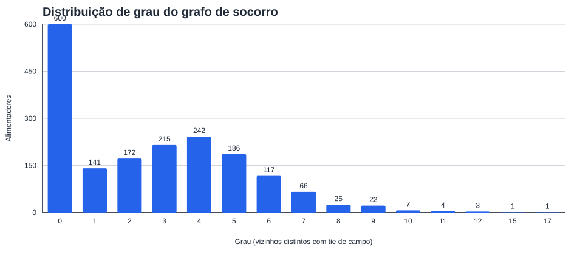

# Atlas de interligações da Light — quem pode socorrer quem

Atlas gerado por `scripts/atlas_interligacoes.py` a partir de `data/parquet`,
reutilizando a
detecção geométrica de ties de `ingest/interligacoes.py` e o inventário por CTMT.

## 1. Resumo executivo

- Alimentadores analisados: **1.802**.
- Ties de campo únicos: **4.524**, dos quais **616** telecomandados.
- Pares chave × CTMT vizinho fora de SE: **4.770**.
- Arestas CTMT–CTMT do grafo de socorro: **2.386**.
- Alimentadores com grau 0 (sem socorro possível): **600**.
- Componentes conexas: **626** (maior componente com **1.097** CTMT).
- Clientes em alimentadores de grau 0: **379.348 / 5.049.006 = 7,51 %**.

A declaração pedida na issue, sem maquiagem, é: **7,51 % dos clientes estão em alimentadores sem socorro possível por tie de campo**.

## 2. Metodologia

- Tie de campo = chave `UNSEMT` normalmente aberta detectada geometricamente a até 2 m de
  extremidade `SSDMT` de outro CTMT, excluindo `EM_SUB=True` (pátio de subestação).
- O relatório por alimentador usa o inventário real da base:
  clientes = `n_UCBT + n_UCMT`.
- O grafo de socorro é simples (`networkx.Graph`): uma aresta por par CTMT–CTMT, com
  atributos `n_ties_campo`, `n_ties_telecomandadas` e lista de chaves. Ties paralelas são
  preservadas nos atributos e nas tabelas exportadas.

## 3. Distribuição de grau

| grau | alimentadores | pct_alimentadores | clientes | pct_clientes |
| --- | --- | --- | --- | --- |
| 0 | 600 | 33,30 % | 379.348 | 7,51 % |
| 1 | 141 | 7,82 % | 191.701 | 3,80 % |
| 2 | 172 | 9,54 % | 498.613 | 9,88 % |
| 3 | 215 | 11,93 % | 797.849 | 15,80 % |
| 4 | 242 | 13,43 % | 1.010.737 | 20,02 % |
| 5 | 186 | 10,32 % | 887.340 | 17,57 % |
| 6 | 117 | 6,49 % | 555.393 | 11,00 % |
| 7 | 66 | 3,66 % | 343.007 | 6,79 % |
| 8 | 25 | 1,39 % | 130.146 | 2,58 % |
| 9 | 22 | 1,22 % | 141.823 | 2,81 % |
| 10 | 7 | 0,39 % | 54.721 | 1,08 % |
| 11 | 4 | 0,22 % | 18.520 | 0,37 % |
| 12 | 3 | 0,17 % | 13.769 | 0,27 % |
| 15 | 1 | 0,06 % | 12.842 | 0,25 % |
| 17 | 1 | 0,06 % | 13.197 | 0,26 % |



## 4. Componentes conexas

| componente_id | n_alimentadores | n_clientes | n_arestas | n_ties_campo | n_subestacoes | amostra_ctmts |
| --- | --- | --- | --- | --- | --- | --- |
| 1 | 1.097 | 4.488.480 | 2.284 | 4.603 | 84 | ABR00019;ABR00020;ABR00021;ABR001;ABR002;ABR003;ABR004;ABR005;ABR007;ABR008 |
| 2 | 29 | 91.974 | 46 | 87 | 3 | FND3262;FND3424;FND3462;FND3726;FND3747;FND4286;FND4304;GNB0001;GNB24905;GNB29069 |
| 3 | 8 | 3.008 | 7 | 7 | 2 | CMR0003;CMR2405;CMR2770;FCN9100;FCN9320;FCN9460;FCN9490;FCN9550 |
| 4 | 6 | 9.997 | 5 | 9 | 2 | BFG24452;BFG24849;HMT3022;HMT3144;HMT3386;HMT3816 |
| 5 | 5 | 6.120 | 5 | 13 | 1 | BFG24599;BFG29165;BFG29289;BFG29902;BFG33234 |
| 7 | 5 | 3.996 | 4 | 7 | 1 | FCN0001;FCN1322;FCN1350;FCN1438;FCN37177 |
| 6 | 5 | 1.012 | 5 | 5 | 2 | BPD1093;BPD4950;SLZ2550;SLZ4500;SLZ4680 |
| 9 | 4 | 11.586 | 3 | 3 | 2 | COP2290;COP2450;LEM2340;LEM2740 |
| 8 | 4 | 2 | 5 | 6 | 1 | CMT1;CMT322;CMT327;CMT353 |
| 11 | 3 | 4.766 | 2 | 2 | 2 | BPD9400;SMT9110;SMT9344 |
| 14 | 3 | 4.736 | 2 | 2 | 1 | PTS9170;PTS9494;PTS9648 |
| 10 | 3 | 2.314 | 2 | 2 | 1 | BFG24750;BFG24942;BFG3931 |
| 12 | 3 | 1.873 | 2 | 2 | 2 | BPD9612;BPD9790;SAT2891 |
| 13 | 3 | 95 | 2 | 2 | 1 | FND1239;FND33454;FND33757 |
| 17 | 2 | 8.373 | 1 | 1 | 2 | COP3736;HMT3401 |

## 5. Alimentadores com mais ties de campo

| COD_ID | NOME | SUB | n_clientes | ties_campo | ties_telecomandadas | grau | alimentadores_socorro |
| --- | --- | --- | --- | --- | --- | --- | --- |
| MTO00002 | LSA MATRIZ | 29148432 | 9.722 | 34 | 8 | 9 | ESP016;MTO00001;MTO00004;MTO0003;PCI0005;PCI0015;PCI0016;STS001;STS004 |
| STS004 | LSA LETICIA | 18521136 | 12.842 | 30 | 2 | 15 | CAM017;CHR0001;CHR0003;CHR002;CHR016;JAB00005;JAB00018;JAB00020;JAB002;JAB003;JAB012;MTO00002;STS001;STS002;STS003 |
| CAM007 | LDA SUEZ | 18520488 | 3.760 | 30 | 2 | 7 | CAM003;CAM006;CAM011;CAM014;CAM019;PMG007;STS005 |
| STS001 | LSA CAVADO | 18521136 | 13.197 | 28 | 4 | 17 | CHR0007;CHR013;CHR014;CHR020;CHR06;ESP017;JAB003;JAB004;JAB013;MTO00001;MTO00002;MTO0003;STS002;STS003;STS004;STS005;STS006 |
| CSO005 | LDA ALFAZEMA/ORQUIDEA | 18520821 | 12.918 | 27 | 4 | 10 | CRM0008;CSO00015;CSO002;CSO004;CSO006;CSO008;CSO010;CSO013;NIG030;QMD007 |
| NIG029 | LSA TROPICAL | 18519976 | 10.221 | 27 | 6 | 9 | ABR00019;ABR005;ABR017;CRM0004;CRM0009;NIG012;NIG026;NIG028;RFR007 |
| PDD9873 | LDA SERPA/REIS | 1231 | 11.432 | 25 | 2 | 11 | CCD803;CCD826;PDD29513;PDD33543;PDD3800;PDD3984;PDD9896;TER29223;TER870;TER895;TER913 |
| QMD008 | LSA CAMPONEZA | 18520893 | 7.221 | 25 | 3 | 5 | QMD002;QMD003;QMD004;RFR006;SRD003 |
| CSO002 | LDA HORTENCIA/CENTAUREA | 18520821 | 9.007 | 24 | 2 | 12 | CSO00017;CSO004;CSO005;CSO007;CSO010;CSO011;CSO013;CSO014;NIG009;NIG017;NIG030;STC00005 |
| RTO00014 | LDA LUXEMBURGO | 18520875 | 4.900 | 23 | 3 | 8 | FTL006;RTO001;RTO008;RTO010;RTO011;RTO013;RTO014;VRD007 |
| PDD29513 | LDA PIAUI/LDA DIVINOR | 1231 | 9.660 | 22 | 3 | 8 | BMT0001;CBI33806;CCD224;CCD70145;CCD757;PDD29568;PDD3356;PDD9873 |
| ESP018 | LSA FRAMBEL | 18519958 | 9.687 | 21 | 3 | 10 | BRI00005;ESP003;ESP009;ESP019;ESP020;MRP00004;QMD002;SRD002;STS002;ZIN005 |
| NIG009 | LDA MOQUETA | 18519976 | 5.280 | 21 | 1 | 9 | CRM0005;CSO00017;CSO002;NIG0004;NIG003;NIG012;NIG015;NIG017;NIG018 |
| QMD002 | LSA MARAJO | 18520893 | 3.492 | 21 | 2 | 8 | ESP018;QMD001;QMD008;QMD009;SRD0005;SRD003;STC00013;STC0014 |
| CEN005 | LSA MATACAES | 18520353 | 10.111 | 21 | 6 | 6 | CEN002;CEN004;CEN006;SCI007;SCI008;SRD004 |

## 6. Alimentadores ilhados (grau 0) com mais clientes

| COD_ID | NOME | SUB | n_clientes | ties_campo | grau | CONJ_NOME |
| --- | --- | --- | --- | --- | --- | --- |
| MRP00009 | LDA ALBERT | 224567922 | 6.133 | 0 | 0 | MARAPICU |
| MRP00007 | LDA PLATAO | 224567922 | 5.168 | 0 | 0 | MARAPICU |
| PTS9310 | LDS 9310 | 10386087 | 4.874 | 0 | 0 | POSTO SEIS SUBTERRANEO |
| MRP00006 | LDA DUMONT | 224567922 | 4.463 | 0 | 0 | MARAPICU |
| FCN1767 | LDS 1767 | 10386105 | 4.178 | 0 | 0 | FREI CANECA AEREO |
| SMT9040 | LDS 9040 | 10385997 | 4.148 | 0 | 0 | SAMARITANO SUBTERRANEO |
| BRR30516 | LDS 30516 | 345834478 | 3.912 | 0 | 0 | BARRA 2 |
| BRR24577 | LDS 24577 | 345834478 | 3.820 | 0 | 0 | BARRA 2 |
| SMT9200 | LDS 9200 | 10385997 | 3.675 | 0 | 0 | SAMARITANO SUBTERRANEO |
| AVD33395 | LDS 33395/LDS 37927 | 10385943 | 3.646 | 0 | 0 | ALVORADA |
| BPD9300 | LDS 9300 | 10385961 | 3.556 | 0 | 0 | BAEPENDI SUBTERRANEO |
| COP9600 | LDS 9600 | 152677490 | 3.450 | 0 | 0 | COPACABANA |
| HMT3463A | LDS 24903/LDS 1872 | 10386096 | 3.332 | 0 | 0 | HUMAITA SUBTERRANEO |
| FCN1667 | LDS 1667 | 10386105 | 3.281 | 0 | 0 | FREI CANECA AEREO |
| BFG1709 | LDS 1709 | 10385934 | 3.181 | 0 | 0 | BOTAFOGO SUBTERRANEO |

## 7. Arquivos rastreáveis versionados

- `docs/dados/atlas-interligacoes-alimentadores.csv`: uma linha por CTMT com grau, ties,
  listas de destinos e componente conexa.
- `docs/dados/grafo-socorro-arestas.csv`: arestas CTMT–CTMT com contagens de
  ties por par.
- `docs/dados/grafo-socorro.graphml`: grafo de socorro em formato aberto.
- `docs/dados/grau-socorro-histograma.svg`: histograma em SVG puro.

## 8. Reprodução

```bash
uv run python scripts/atlas_interligacoes.py \
  --parquet-dir data/parquet \
  --out docs/atlas-interligacoes.md
```
