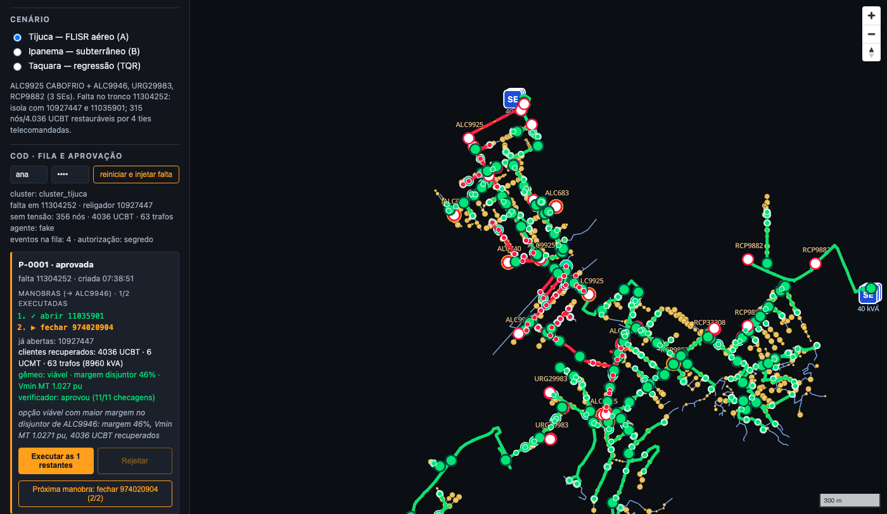

# Console do COD — fila, proposta e aprovação (`bdgd-light serve`, issue #35)

Fecha o laço da fase 3 num só processo: **evento** (simulador) → **agente** (orquestrador +
verificador, #34) → **proposta** pendente → **operador aprova/rejeita no console** → **gêmeo
executa** as manobras → **mapa recolorido** e **auditoria** encadeada por hash. Continua valendo o
princípio do MVP: o modelo nunca chega a `set_switch`; a única porta para alterar a rede é a decisão
humana, registrada em `hitl.jsonl`.

```
console (Vite/MapLibre) ── GET /api/estado (2 s) ──▶ FastAPI (bdgd_light.console.api)
   │ injetar falta         POST /api/eventos            │ FilaEventos (JSONL) ── AgenteEmSegundoPlano
   │ Aprovar/Rejeitar      POST /api/propostas/{id}/…   │   (thread por evento) ──▶ Orquestrador ──▶ SessaoCOD
   └ mapa                  GET /api/estado.geojson      └ humano.aprovar/rejeitar ──▶ SessaoCOD.set_switch
                                                             (X-Operador + BDGD_CONSOLE_TOKEN → hitl.jsonl)
```

## Subir

```bash
uv sync --extra dev --extra twin --extra agent --extra console
(cd console && npm ci && npm run build)                 # dist/ é servido em /
BDGD_CONSOLE_TOKEN=demo uv run bdgd-light serve --cluster tijuca --provider fake
#  ✔ cluster_tijuca: 1.662 nós, 148 chaves, 23 ties
#  console: http://127.0.0.1:8000/ · API: http://127.0.0.1:8000/api/estado · docs: /docs
```

Abra `http://127.0.0.1:8000/?cenario=tijuca`, preencha operador e token (`demo`) no painel **COD ·
fila e aprovação** e clique **injetar falta**. O agente localiza, isola e avalia as opções no gêmeo;
a proposta aparece com manobras, clientes recuperados, veredito do gêmeo (margem no disjuntor, Vmin
MT) e do verificador (checagens aprovadas/total), motivo e alternativas descartadas. **Aprovar e executar**
executa a sequência e o mapa recolore (trechos reenergizados voltam a verde; a zona da falta segue
vermelha). **Rejeitar e replanejar** agora traz um campo de motivo com sugestões clicáveis
(`a chave … está em manutenção`, `não quero carregar o BOMPASTOR`, `prefiro a rota telecomandada`);
o backend rejeita a proposta, registra `hitl.rejeicao`, extrai a restrição estruturada e dispara uma
nova execução do agente para a mesma falta, sem reinjetar o evento. A proposta seguinte mostra
`replanejada após rejeição: <motivo>`. O limite é **3 replanejamentos automáticos por evento**; ao
atingi-lo, o console para de replanejar e pede intervenção humana. A auditoria lista os últimos
registros e "trilha íntegra ✓ hash". Com uma falta já tratada o botão vira **reiniciar e injetar
falta** (recarrega o cluster — rede normal, propostas em aberto expiradas — e injeta de novo).

| opção de `serve` | padrão | descrição |
|---|---|---|
| `--cluster` | — | carrega ao subir (`tijuca`, `ipanema`, `taquara` ou GeoPackage); sem ele, o primeiro evento carrega o do cenário |
| `--provider`, `--modelo` | `fake` | LLM do agente: `fake` (operador roteirizado, sem rede), `openai`, `gemini`, `ollama` (perfis da ADR-003) |
| `--host`, `--porta` | `127.0.0.1`, `8000` | endereço HTTP |
| `--dist` | `console/dist` | console compilado servido em `/`; sem a pasta, só a API (`npm run dev` faz proxy de `/api`) |
| `--sem-segredo` | off | aceita decisões só com `X-Operador` (demo local); sem a flag e sem `BDGD_CONSOLE_TOKEN`, injeção/aprovação respondem 503 |
| `--sem-agente` | off | só fila, estado e aprovação; as propostas vêm de outro processo (`bdgd-light agente`/MCP) pela mesma pasta `--estado` |
| `--max-rodadas`, `--replanejar`, `--top-k`, `--sem-score`, `--vmin`, `--vmax` | `8`, `2`, `3`, off, `0.93`, `1.05` | parâmetros do orquestrador/verificador (ver `docs/agent.md`) |
| `--fila`, `--feeders`, `--dss-out`, `--estado`, `--dia`, `--mes` | `data/eventos/eventos.jsonl`, `data/feeders`, `data/dss/gpkg`, `data/agent`, `DU`, `1` | os mesmos de `sim`, `mcp` e `agente` |

## API

Todas as rotas devolvem JSON; erros de domínio (`SessaoError`) viram **409** com `detail`.

| rota | resposta | observações |
|---|---|---|
| `GET /api/estado` | `SessaoCOD.estado()` (cluster, `cluster_demo`, falta, religador, `sem_tensao`, propostas sem token, `audit_n`, `hash`) + `eventos_n`, `agente` (`ocupado`, `provider`, `modelo`, `evento_atual`, `erro`, `n_execucoes`, `ultima`), `autorizacao` (`segredo`/`sem-segredo`/`bloqueado`), `hora` | o console faz *polling* a cada 2 s |
| `GET /api/estado.geojson` | `grid.geojson.estado_geojson(rede)` | 404 sem cluster; o console recarrega quando o `hash` da auditoria muda |
| `GET /api/eventos?desde=N` | eventos da fila a partir do id `N` | pedido da revisão PR-13 |
| `POST /api/eventos` → **202** | `{evento, agente: iniciado\|ocupado\|desligado}` | corpo: `{cenario}` (nomeado, ex. `tijuca_cabofrio_tronco`) **ou** `{tipo?, trecho?, ctmt?, chave?, cluster?, seed?}` (sem `tipo`, o alvo decide: trecho → falta permanente, CTMT → pico, chave → indisponível); `recarregar: true` recarrega o cluster antes; `agente: false` só publica. Exige operador; **409** se o agente está ocupado; 404 se o recorte do cenário não existe |
| `GET /api/propostas?status=` | lista sem token | |
| `GET /api/propostas/{id}` | proposta + `alternativas` (opções de `restore_options` com o último score, a escolhida primeiro) + `verificador` (veredito da execução do agente que a gerou) | `alternativas = []` após executada |
| `GET /api/propostas/{id}/eletrico` | detalhes elétricos por opção simulada (`score=true`): corrente/margem do disjuntor, Vmin/Vmax MT com barra, perdas, top 5 trechos carregados, convergência e perfil de tensão MT | o console usa no expansor **detalhes elétricos**; se a proposta já foi executada, devolve ao menos a opção escolhida gravada na proposta |
| `POST /api/propostas/{id}/aprovar` | `{operador, proposta, execucao, erro}` | corpo `{executar?: true, validade_s?: 1800}`; aprova **e executa** por padrão (no transporte MCP http o padrão é só aprovar); grava `hitl.aprovacao` com `origem: console`. Com manobras já aplicadas pelo modo passo a passo, executa só as restantes |
| `POST /api/propostas/{id}/passo` | `{operador, passo, erro, proposta}` | **modo passo a passo**: aprova a proposta se ainda pendente (`hitl.aprovacao` com `executar: "passo"`) e aplica **só a próxima manobra** (`Proposta.proximo_passo`) com `set_switch` + token da proposta; grava `hitl.passo` (`manobra`, `passo`, `n_passos`). Uma chamada por manobra; a n-ésima marca a proposta `executada`; a seguinte responde 409 |
| `POST /api/propostas/{id}/rejeitar` | `{operador, proposta, replanejamento}` | corpo `{motivo?}`; rejeita a proposta, registra `hitl.rejeicao` e, se houver agente e o limite de 3 não tiver sido atingido, dispara um replanejamento para a mesma falta com a restrição derivada do motivo |
| `GET /api/auditoria?n=12` | `{n_total, integra, hash, registros[]}` compactos (sem `approval_token`) | `integra` vem de `AuditLog.verificar()` na cadeia inteira |
| `GET /api/agente?n=5` | estado + últimas execuções (resumo: proposta, rodadas, ferramentas, recusas, tempos, resposta) | |
| `GET /docs` | OpenAPI | |

**Identidade e autorização** (`mcp_server/humano.py`, compartilhado com as rotas humanas do `mcp
--transporte http`): `X-Operador` é obrigatório nas decisões (400 sem ele) e vai para
`aprovada_por`/`hitl.jsonl`; o segredo `BDGD_CONSOLE_TOKEN` é conferido em `Authorization: Bearer`
ou `X-Console-Token` com `compare_digest` (401 se errado; 503 se o servidor não tem segredo nem
`--sem-segredo`). O console guarda operador e token no `localStorage`.

## Front-end (`console/src/cod.ts`)

- Base da API: `?api=http://host:porta` ou `api/` relativo à base do site. A primeira sonda decide:
  sem resposta (GitHub Pages, `vite dev` sem backend) a seção fica oculta e o console segue só com
  mapa + estado estático do cenário.
- Com backend **e** cluster carregado, o estado vivo (`/api/estado.geojson`) substitui o GeoJSON
  estático (`?estado=`), reaproveitando a fonte `estado` e a legenda de `estado.ts`.
- O botão "injetar falta" manda o cenário nomeado correspondente ao cenário do console
  (`tijuca → tijuca_cabofrio_tronco`, `ipanema → ipanema_9210`, `taquara → taquara_bocari`); se o
  backend está com outro cluster (`cluster_demo`), o painel avisa qual `?cenario=` abrir.
- **Modo passo a passo** (pedido da revisão PR-15 / backlog 16): o cartão da proposta traz, além de
  "Aprovar e executar", o botão `#cod-passo` — "Aprovar e executar a 1ª manobra: abrir X (1/n)" e
  depois "Próxima manobra: fechar Y (k/n)" — que chama `POST …/passo`. A lista `<ol.cod-manobras>`
  marca ✓ (`li.feita`) as aplicadas e ▶ (`li.atual`) a próxima; o rótulo mostra `k/n executadas`;
  "Aprovar e executar" vira "Executar a última"/"Executar as k restantes" e "Rejeitar" desabilita
  depois da primeira manobra aplicada. Como cada `set_switch` entra na auditoria, o `hash` muda e o
  mapa recolore a cada passo sem nada especial no front.
- **Rejeição com motivo** (issue #61): o cartão agora traz um `input` para o motivo e três sugestões
  clicáveis. Ao rejeitar, o console faz `POST …/rejeitar {motivo}`; se o backend devolver
  `replanejamento.status = limite`, mostra a mensagem de intervenção humana. Enquanto as alternativas
  replanejadas aparecem, as opções vetadas continuam visíveis em `alternativas`, mas com
  `bloqueada: <motivo>` para o operador entender por que foram descartadas.
- **Detalhes elétricos** (issue #63): o cartão da proposta ganhou um expansor com a visão do
  OpenDSS por opção simulada. A tabela compara margem no disjuntor, Vmin/Vmax MT, perdas,
  convergência e o trecho mais carregado; para a opção escolhida o console desenha um sparkline
  simples do perfil de tensão MT da fonte até a ponta e a tabela dos top 5 trechos carregados
  permite clicar num `COD_ID` para destacá-lo no mapa.
- `window.cod` expõe `estado`, `atualizar()`, `injetar()`, `aprovar(id)`, `passo(id)`,
  `rejeitar(id, motivo)` para depuração e para o smoke.
- Smoke ponta a ponta: `SMOKE_FLUXO=1 SMOKE_TOKEN=demo node scripts/smoke.mjs
  "http://127.0.0.1:8000/?cenario=tijuca"` injeta, espera a proposta, aprova e confere que o número
  de trechos desenergizados no mapa caiu; falha se passar de 60 s ou o mapa não mudar. Variáveis:
  `SMOKE_PASSOS=1` usa o modo passo a passo e **falha se o número de cliques for diferente do de
  manobras** ou se um clique aplicar mais de uma; `SMOKE_CAPTURAS=<pasta>` grava um PNG por etapa
  (`1-evento`, `2-proposta` com as alternativas abertas, `2b-passo`, `3-executada`) — são as
  capturas do README em `docs/img/`; `SMOKE_BASE=base-nenhuma` fotografa sobre o fundo escuro
  (~315 KB por PNG contra ~1,9 MB com a imagem de satélite); `SMOKE_OPERADOR` (padrão `smoke`).

## Validação local (2026-09-10, Tijuca, `--provider fake`, macOS arm64)

| rodada | proposta | tempo até a proposta | total (injetar → mapa recolorido) | trechos desenergizados (antes / na falta / após) |
|---|---|---|---|---|
| 1 (sessão nova) | P-0001: abrir 11035901, fechar 974020904 → ALC9946; 4.036 UCBT; margem 46 %, Vmin 1,027 pu | 17,2 s | **19,6 s** | 0 / 467 / 72 |
| 2 (reiniciar e injetar) | P-0002: idem | 12,4 s | **14,7 s** | 72 / 467 / 72 |

O tempo é quase todo do gêmeo (`restore_options --score` = um fluxo de potência do cluster por opção
de restauração + a montagem do `Master` do cluster na primeira rodada; `segundos_ferramentas ≈ segundos_total`); com LLM real soma-se
a latência do modelo. Critério do backlog (< 30 s ponta a ponta na demo local) atendido com o
operador fake.

Com LLM real (`--provider gemini --sem-segredo`, `gemini-2.5-flash`, mesmo fluxo pelo smoke):

| execução | plano | rodadas / ferramentas | LLM | ferramentas | agente (total) | tokens | recusas |
|---|---|---|---|---|---|---|---|
| P-0001 (sessão nova) | abrir 11035901, fechar 974020904 → ALC9946 (idem fake) | 5 / 4 | 23,4 s | 18,0 s | 41,4 s | 53.837 | 0 |
| P-0002 (reiniciar) | idem | 5 / 4 | 25,7 s | 32,5 s | 58,2 s | 54.359 | 0 |
| P-0003 (reiniciar) | idem | 5 / 4 | 19,6 s | 27,2 s | 46,8 s | 54.296 | 0 |

Na P-0003 a linha do tempo da auditoria foi: `agente.inicio` 18:06:10 → `propose_plan` 18:06:53 →
`agente.fim` 18:06:57 → `hitl.aprovacao` (operador `vinicius`) 18:06:58 → duas `set_switch` e mapa
recolorido (467 → 72 trechos) em seguida. O Gemini escolhe a mesma opção do operador fake e justifica
pela margem do disjuntor (46 % contra 20 % das opções do RCP9882 e sobrecarga de 180 % nas do
URG29983). Dois cuidados que saíram dessa rodada:

- o Gemini às vezes devolve `finish_reason = MALFORMED_FUNCTION_CALL` com mensagem vazia (sem
  `content` nem `tool_calls`); `OpenAICompatClient.chat` agora repete a chamada
  (`RespostaVaziaError`, até `max_tentativas`, padrão 3 nos perfis reais) em vez de encerrar a
  execução com erro;
- o botão **Aprovar e executar** fica desabilitado enquanto o agente ainda escreve a resposta final
  (alguns segundos com LLM real); o smoke espera `agente.ocupado = false` antes de clicar.

Modo passo a passo (2026-09-11, `SMOKE_PASSOS=1`, sessão nova, Tijuca):

| provedor | proposta em | agente livre em | cliques | trechos MT sem tensão (falta / após abrir / após fechar) | total | rodadas / tokens |
|---|---|---|---|---|---|---|
| `fake` | 7,5 s | 7,5 s | 2 = 2 manobras | 467 / 467 / 72 | **11,6 s** | — |
| `gemini` (`gemini-2.5-flash`) | 19,4 s | 22,7 s | 2 = 2 manobras | 467 / 467 / 72 | **26,9 s** | 5 / 24.253 |

Abrir a chave de isolamento (11035901) não reenergiza nada — o mapa só muda no segundo clique, quando
o tie 974020904 fecha e ALC9946 assume a carga; é exatamente o que se quer mostrar em aula.

### Replanejamento após rejeição (fluxo esperado)

Com LLM real, o replanejamento tende a ser mais rápido que a primeira proposta porque a falta já está
registrada, o cluster já está carregado e não há nova injeção do evento; o ciclo esperado é:

1. operador rejeita a proposta e informa o motivo;
2. `/api/propostas/{id}/rejeitar` devolve `replanejamento.status = iniciado`;
3. a auditoria registra `hitl.rejeicao` e `agente.replanejamento`;
4. a proposta seguinte aparece com `replanejada após rejeição: <motivo>`;
5. `alternativas` mantém as rotas vetadas, marcadas como `bloqueada`.

Para a demo da issue #61, o objetivo operacional é a nova proposta surgir em **menos de 40 s** com
sessão aquecida e LLM real. O teste automatizado usa `--provider fake`: rejeitar `"a chave CH003
está em manutenção"` gera a P-0002 por outra chave viável e o verificador recusa qualquer insistência
na CH003.



## Decisões

- **Um processo, uma sessão.** `serve` cria a `SessaoCOD`, o `Orquestrador` e a `FilaEventos` e os
  compartilha com a API; `--sem-agente` permite que as propostas venham de outro processo pela mesma
  pasta `--estado` (fila de propostas em `propostas.json`).
- **Agente em thread, não em processo.** `AgenteEmSegundoPlano` roda o orquestrador numa thread por
  evento (uma execução por vez; 409 enquanto ocupado). O estado do agente (`evento_atual`, `erro`,
  últimas 20 execuções) é consultável e entra em `/api/estado`.
- **Motor OpenDSS num subprocesso (issue #48).** O DSS C-API (Free Pascal) só aceita chamadas da
  thread que o importou — de qualquer outra o processo morre com `SIGILL`, inclusive com
  `DSS.NewContext()` (medido no macOS arm64, `opendssdirect 0.9.4`/`dss_python 0.15.7`) — e a sua
  finalização na saída do processo derrubava a CI Linux com `SIGSEGV` (exit 139) depois da suíte
  verde, de forma não determinística (2/2 no Actions, 1/3 em contêiner limpo, 0/4 em imagem com venv
  pré-construído; nunca no macOS). Como o gêmeo é chamado de threads diferentes (agente, handlers
  HTTP), `twin.powerflow.no_motor` encaminha toda chamada (`_run_powerflow`, `_ampacidade_tronco`:
  funções de módulo com argumentos serializáveis) para um **subprocesso reciclável dedicado**
  (`MotorProcesso`): o processo pai nunca carrega a biblioteca, a saída é a normal e o entry point
  voltou a ser um `sys.exit` simples. Uma chamada por vez (trava), resultado e exceções voltam por
  `Pipe` (pickle; exceções sem construtor compatível viram `ErroOpenDSS` com o mesmo texto). Se o
  filho morrer no meio de uma chamada (`SIGILL`/`SIGSEGV`/sem resposta em `BDGD_MOTOR_TIMEOUT`,
  padrão 600 s) a chamada levanta `MotorError`, que o agente registra como erro da ferramenta
  (`{"erro": …}` para o modelo) e a **chamada seguinte recria o motor**; `/api/estado` expõe
  `motor` (`modo`, `pid`, `chamadas`, `reinicios`) e `twin.powerflow.simular_falha_do_motor`
  reproduz a falha nos testes (`test_motor_morre_durante_o_agente_e_o_console_sobrevive`). Custo:
  ~0,8 s para criar o filho na 1ª chamada (importa pandas + opendssdirect) e ~1 ms por chamada
  (pickle do `PowerFlowResult`); o fluxo em si (2–3 s no cluster Tijuca) não muda. Os testes
  continuam proibidos de importar `opendssdirect` na coleta (`importlib.util.find_spec` no lugar de
  `importorskip`; `tests/conftest.py` falha a coleta se isso voltar a acontecer).
- **Aprovar = executar** no console (o operador vê e decide num clique); no MCP http o padrão
  continua "aprovar e devolver o token" para o agente/cliente executar. O **passo a passo** reutiliza
  o "passo único" que o servidor MCP já impunha (`set_switch` só aceita a próxima manobra da
  proposta, incrementa `executadas` e marca `executada` ao fim): o lado humano
  (`humano.executar_passo`) aprova e executa exatamente um passo por chamada, e a mistura com
  "Aprovar e executar" é permitida porque `executar_proposta` fatia a partir de `executadas`.
- **Sem WebSocket**: *polling* de 2 s em `/api/estado` é suficiente para a demo e evita mais um
  canal; o mapa só é recarregado quando o `hash` da auditoria muda.
- O veredito do verificador vive na **execução** do agente (não na proposta da sessão, que é
  agnóstica ao agente): `/api/propostas/{id}` o anexa a partir de `AgenteEmSegundoPlano.execucoes`.

## Pendências

- Vários operadores/sessões simultâneas e persistência do estado do agente entre reinícios.
- Notificações *push* (SSE/WebSocket) em vez de *polling*, se a fila crescer.
- GIF/vídeo da demo (o README tem as 3 capturas PNG do smoke; sem `ffmpeg`/`gifski` na máquina da
  noite 3 — com eles, `SMOKE_CAPTURAS` + `gifski -o demo.gif *.png`).
- Benchmark (#36) com OpenAI × Gemini × fake pela mesma API; a demo com OpenAI ainda não foi feita
  (chave ausente nesta máquina nas noites 2 e 3).
